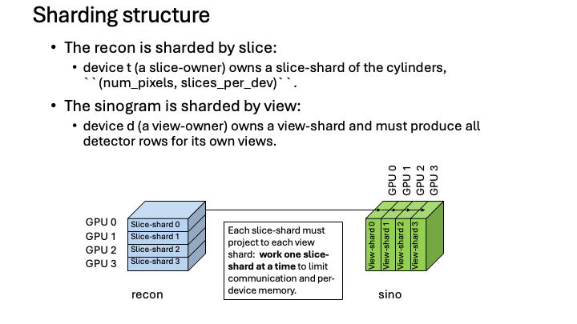

.. _ShardingOverview:

=================
Sharding Overview
=================

This page describes how MBIRTorch spreads a single reconstruction across several
devices.  It is a developer-oriented overview of the architecture -- enough to
follow how the pieces fit together and where they live in the code, not a
line-by-line specification.  For the user-facing view (how to turn it on and
control it), see :doc:`usr_multi_gpu`.

**Scope.**  Sharding runs within a single process across the chosen devices
(multiple GPUs, or CPU devices).  It works for all of the library's
geometries: parallel-beam, cone-beam, translation, and multi-axis parallel.  A key invariant is that **the padding never changes the result**:
when a count does not divide evenly the data is zero-padded to equal shares and
the padding is kept exactly inert.  Results can still differ slightly with the
device count, and the difference decays as iterations proceed.  Multi-node
execution is out of scope.
As in MBIRJAX, the device layout is chosen automatically -- on CUDA with two or
more visible devices, a reconstruction spreads across the devices that can hold
their share.  :meth:`~mbirtorch.TomographyModel.configure_devices` is the
explicit door out of that choice, and ``configure_devices(num_devices=1)`` is
the reproducibility pin.

The two shardings
-----------------

MBIRTorch shards the two large arrays along complementary axes:

* the **reconstruction is sharded by slice** -- each device (a *slice-owner*)
  holds a contiguous band of slices of the voxel cylinders,
  ``(num_pixels, slices_per_device)``;
* the **sinogram is sharded by view** -- each device (a *view-owner*) holds a
  block of views and is responsible for producing *all* detector rows for those
  views.

   The recon is sharded by slice (left); the sinogram by view (right).  Every
   slice-shard must reach every view-shard, so projection is an all-to-all
   between the two layouts.

Because the two arrays are sharded on different axes, projecting between them is
an all-to-all: every slice-shard contributes to every view-shard, and vice
versa.  To bound both the inter-device communication and the peak per-device
memory, the projectors **work one slice-shard at a time** rather than moving the
whole volume at once.

Placement and Shards: the device layout and the device form
------------------------------------------------------------

Device layout is described by a single object, ``Placement`` (in
``mbirtorch/_sharding.py``).  A placement records:

* the list of ``devices``;
* which array ``axis`` is sharded;
* the ``real_size`` of that axis and the ``padded_size`` (rounded up to a
  multiple of the device count).

A model carries two placements -- ``recon_placement`` (slice axis) and
``sino_placement`` (view axis) -- and these are the **single source of truth**
for where every array lives; there is no separate "main device" or "is-sharded"
state.  A single device is the trivial one-shard case, and the placement
functions return plain tensors there, so the ``n = 1`` path is unchanged.

The *device form* of a sharded array is a ``Shards`` container: the per-device
tensors plus their placement.  This is where MBIRTorch diverges most sharply from
MBIRJAX.  JAX offers a single logically-global sharded array, assembled with
``jax.make_array_from_single_device_arrays``, and MBIRJAX's code operates on that
global array.  Torch's counterpart, DTensor, was deliberately rejected as immature
for these index-heavy kernels, so there is no global array here.  ``Shards`` is a
plain container instead: it holds the tensors, checks on construction that each
shard really lives on its placement's device, and exposes ``gather()`` as the host
exit.  The drivers and the VCD loop operate on the per-device tensors directly.

Padding is **exactly inert** (entry zero-fill, projector output masks, and the
prior-interface mask all keep it from affecting any result), which is what makes
the output independent of the device count.

One layout is refused: a device holding no real data on **either** axis, since it
would do no work.  A device idle on only one axis is legal and useful, and this is
a deliberate extension beyond MBIRJAX.  With fewer slices than devices the extra
devices still project their views, which dominates there; with fewer views than
devices they still hold slice shards and run the prior and updates, which dominate
there (``_check_no_empty_shard`` in ``tomography_model.py``).

Forward and back projection by bands
-------------------------------------

Within a slice-shard the work can be subdivided once more, into **bands** of
slices.  Both projectors run a double loop: over slice-shards (outer) and over
bands (inner).  Banding bounds the size of the transient buffers that arise while
moving data between the two shardings.

.. figure:: figs/sharding-forward-bands.png
   :width: 90%
   :align: center

   Forward projection: one band is broadcast to every view-owner, each
   view-owner forward-projects its own views from that band (accumulating), and
   the result is already a view-sharded sinogram.

**Forward projection** (recon → sinogram) broadcasts each band to every
view-owner; each view-owner forward-projects its own views from that band and
accumulates into its part of the sinogram.  When the loop finishes, the sinogram
is already in the view-sharded layout.

.. figure:: figs/sharding-back-bands.png
   :width: 90%
   :align: center

   Back projection: each view-owner back-projects to a single band; the
   contributions are reduced (summed) over views into the recon's slice
   sharding.

**Back projection** (sinogram → recon) is the adjoint: each view-owner
back-projects into a band, and the per-view contributions are reduced (summed)
and scattered into the slice-owner that holds those slices -- a reduce-scatter.
The result is already in the slice-sharded recon layout.

The two directions are the adjoint pair ``broadcast_band_to_views`` (all-gather)
and ``sum_band_to_owner`` (reduce-scatter).  Broadcast-to-N is the transpose of
sum-from-N, which is what keeps forward and back projection adjoint under
sharding.

The reduce **streams**.  It forms the running total for a band once on the
slice-owner and then adds each arriving partial one bounded row slab at a time,
so the owner holds one slab per source above that total instead of every
partial at once.  The summation order is untouched, so the streamed result is
bit for bit the one-shot sum.  This is what makes the reduce shrink as devices
are added: it used to hold n whole bands, and n bands of 1/n of the volume each
is the same number of bytes at every device count.

**The default band is the whole shard**, which differs from MBIRJAX deliberately
and on measurement.  MBIRJAX's sweeps found time flat across band length, so it
streams by default for the memory win.  The torch banded pass pays a fixed
orchestration cost per band: with the compiled kernels in place, sub-band walks
measured 2 to 23 percent more busy time at parallel 1024 with two devices,
depending on the walk (an earlier pre-kernel reading of 47 to 66 percent
overstated the cost).
MBIRJAX's stream-even-at-one-device rationale is also void here, because a single
torch device never runs the banded drivers at all -- the trivial path uses the
plain projectors.  A smaller band remains a real **memory** lever, since the
per-band broadcast copy and the per-band partial scale with it; what it sets in
the reduce is the running total the slabs are added into, the bands already
reduced this pass being held either way.  Set ``forward_project_slice_band`` or
``back_project_slice_band`` on the model to opt in (``_slice_band_length`` in
``tomography_model.py``).

Why cone beam projects whole cylinders
--------------------------------------

In parallel-beam geometry detector row ``r`` maps only to slice ``r`` with no
cross-row mixing, so a device can produce just the slices a destination needs by
first slicing its sinogram views to those rows -- the transient cylinder buffer
can be held at one destination's slice range.  ``ParallelBeamModel`` declares this
with ``rows_track_slices = True``.

Cone beam cannot do this cheaply: magnification maps a single slice to a
*data-dependent band* of detector rows (dependent on the cone angle and the
particular slice), so the slice and detector-row axes are coupled.  This
projection could proceed one band of slices at a time, but then each detector row
requires multiple updates from a single voxel cylinder.  Alternatively, each view
owner can collect all the bands for a batch of pixels and then project the
resulting full cylinders.

A view-owner therefore collects the **full voxel cylinder** once and then projects
the full cylinder, rather than restricting the computation to a band up front.
This coupling is also why the sinogram is sharded by view (not by detector row)
uniformly across geometries.

Projector kernels
-----------------

The kernels that run within each band or shard -- the torch.compile view-batch
bodies, the shared horizontal-fan contract, and the optional hand-written Triton
kernels layered on top of them -- are described in :doc:`dev_projector_kernels`.

The QGGMRF prior and halos
--------------------------

The QGGMRF prior is local: each voxel interacts only with its neighbors.  Across
slices that means a slice-owner can evaluate the prior on its own band entirely
locally **except** at the boundary between two adjacent slice-shards, where it
needs the neighbor's boundary slice.  Those boundary slices are exchanged as
**halos** between neighboring owners: the last slice of the shard to the left and
the first slice of the shard to the right, each moved to the receiving shard's
device.  At the outer edge of the volume there is no neighbor, so the boundary
condition is reflection; a single shard is reflected at both edges and needs no
halos at all (``exchange_qggmrf_halos`` in ``_sharding.py``).

Halo staging happens host-side and so cannot live inside a compiled region, which
drives the single- vs multi-device split below.

Single- and multi-device paths
-------------------------------

The prior-bearing reconstruction loop takes one of two paths depending on the
device count:

* **One device** -- the trivial placement, the plain projectors, and the compiled
  per-device bodies.  A single shard is reflected at both edges, so no halos are
  needed.
* **Several devices** -- a Python loop runs the passes, staging the halos
  host-side once per pass (the part that cannot be compiled), while the
  on-device per-pass work stays compiled.

Both paths converge to the same result; only the boundary handling and the loop
structure differ.

The QGGMRF denoiser is single-device only.  Sharding it is possible future work,
and was not efficient in MBIRJAX, so the trade needs measuring in torch before it
is worth doing.

Multi-device execution: thread pools
------------------------------------

The steps above all share a common substrate: run a kernel on each device, then
combine the per-device outputs.  Within a single step the per-device kernels are
independent (each device works on its own shard or band); the cross-device
communication -- the broadcast in forward projection, the reduce-scatter in back
projection -- happens *between* steps, not inside them.  The design problem is to
launch those per-device kernels and reassemble their outputs **without bouncing
data through host memory**.

MBIRTorch uses a **thread pool with one worker per device**: each thread operates
on its device's tensors in place, runs the per-device kernel, and keeps its result
on-device (``device_pool`` / ``run_per_device`` in ``_sharding.py``).  Two details
differ from the MBIRJAX port of the same idea.  Torch needs no thread-local
default device, because tensors carry their own device, so a worker simply operates
on the tensors it is given.  And a single device short-circuits to a direct call on
the calling thread, with no pool and no thread hop, so code written uniformly over
shards costs a plain function call at ``n = 1``.

``run_per_device`` performs no synchronization.  Results come back in device order
rather than completion order, and a caller that needs values materialized
synchronizes explicitly.  That is what lets a caller overlap the next band's
transfer with the current band's compute.

Safe cross-device transfer
--------------------------

All cross-device movement goes through one primitive, ``move_shard``.  It exists
because JAX's ``device_put`` silently corrupted device-resident transfers on some
GPUs (L40S).  Torch's ``tensor.to()`` has no known equivalent failure, but the
empirical probe is kept as near-free paranoia: ``is_dev2dev_safe`` moves a small
known array between two devices once per configuration and checks that the value
survives.  When the probe fails, ``move_shard`` routes transfers through host
memory, which is always correct and slower, and warns once per process.

The principle is worth stating on its own: the hardware is tested rather than
assumed, once per device set, at a cost of microseconds.

Where this lives in the code
-----------------------------

* ``mbirtorch/_sharding.py`` -- ``Placement``, ``Shards``, the transfer
  primitives, the banded adjoint pair, the halo exchange, and the thread-pool
  execution helpers.  MBIRJAX splits these across a ``_sharding/`` package; here
  they are one module.
* ``mbirtorch/tomography_model.py`` -- the placement chokepoints, the banded
  sharded drivers, the band-length policy, and the sharded VCD engine.
* ``mbirtorch/projectors.py`` -- the geometry-agnostic view-range drivers and the
  torch.compile plumbing.
* ``mbirtorch/horizontal_fan.py`` -- the shared horizontal-fan kernels and the
  fan data contract.
* the per-geometry view-batch bodies in ``parallel_beam.py`` and ``cone_beam.py``.

The correctness gates for the sharding invariants are in ``tests/test_sharding.py``
(23 tests).  The strongest of them compare against a single-device reference:
the banded projectors, the cone FDK, and the full VCD reconstruction must each
match the single-device result, and must still match when the axes do not divide
evenly and padding is present.  The adjoint property is checked directly on the
banded pair, the halo exchange is checked against a full-volume prior, and the
awkward layouts (more devices than slices, more devices than views, a fully idle
device) each have their own test.
