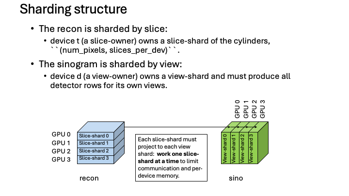
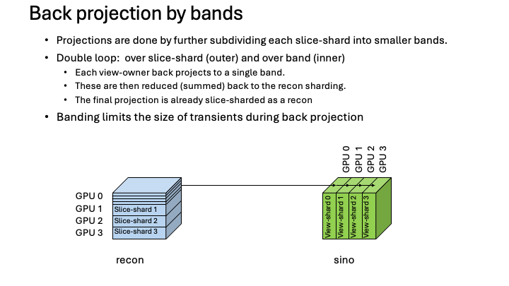

.. _ShardingOverview:

=================
Sharding Overview
=================

This page describes how MBIRTorch spreads one reconstruction across several devices.  It is
written for a developer who is about to read the code.  For how to use several GPUs, see
:doc:`usr_multi_gpu`.

A reconstruction runs in one process on the devices it is given.  The devices are usually GPUs,
but a list of CPU entries runs the same code on the CPU, which is how the tests run without a
GPU.  All geometries are supported.

What is split
-------------

The two large arrays are split along different axes.  The reconstruction is split by slice, so
each device holds a band of slices for every voxel.  The sinogram is split by view, so each
device holds a block of views with all of their detector rows.  A device count need not divide
either axis evenly.  The pieces then differ in length by one, and nothing is padded.

   The reconstruction is split by slice (left) and the sinogram by view (right).

The class ``Placement`` in ``mbirtorch/_sharding.py`` records a device list, the axis that is
split, and the range each device holds.  A model has two placements, one for the reconstruction
and one for the sinogram, and they are the only record of where each array lives.  The class
``Shards`` holds the per-device tensors of one array together with their placement, and its
``gather`` method copies the array back to the host.  With one device, both classes reduce to a
plain tensor.

A device that would hold no data on either axis is refused, because it would do no work.  That
happens only when the device count exceeds both the view count and the slice count.

Forward projection
------------------

Because the two arrays are split on different axes, projection moves data between every pair
of devices.  For the forward projection, each device that owns views loops over batches of
voxel positions.  For each batch it copies the full-height voxel cylinders from every slice
owner, projects them onto its own views, and moves on.  The batch width, not the device count,
sets the size of the copy, and the result is already split by view.  Setting
``forward_project_pixel_batch`` on the model fixes the batch width.

Cone beam projects whole cylinders because magnification maps one slice to a range of detector
rows that depends on the slice.  Parallel beam has no such coupling, but it uses the same path
so that all geometries share one driver.

Back projection
---------------

Each device that owns views back projects its views into one band of slices.  The partial
results for that band are summed on the device that owns those slices, one source at a time
and in slabs of bounded size, so the memory held during the sum does not grow with the device
count.  The result is already split by slice.  The band is the whole slice shard by default.
Setting ``back_project_slice_band`` on the model uses a shorter band, which lowers peak memory
at some cost in time.

   Each view owner back projects into one band, and the partials are summed on the slice owner.

The prior
---------

The qGGMRF prior couples each voxel to its neighbors, including one neighbor in each adjacent
slice.  A slice owner therefore needs one slice from each neighboring owner at the boundary of
its band.  Those boundary slices are exchanged before each pass.  At the ends of the volume the
boundary condition is reflection, so one device needs no exchange.

The exchange is staged on the host, so it cannot live inside a compiled kernel.  For that reason
the reconstruction loop has two paths.  With one device the whole pass is compiled.  With several
devices a Python loop runs the passes, exchanges the boundary slices between them, and calls the
compiled per-device work inside each pass.  The two paths give the same result.

Execution
---------

Each step runs one kernel per device and then combines the outputs.  The per-device kernels run
in a thread pool with one thread per device, and each thread works on its own device's tensors in
place.  With one device the kernel is called directly on the calling thread.

All copies between devices go through ``move_shard``.  Once per device set it copies a small
known array between two devices and checks the value.  If the check fails, later copies go
through host memory, which is slower and always correct.

Where to look
-------------

- ``mbirtorch/_sharding.py``: ``Placement``, ``Shards``, ``move_shard``, the cylinder transfer,
  the band sum, the boundary-slice exchange, and the thread pool.
- ``mbirtorch/tomography_model.py``: the placements, the sharded projection drivers, the batch
  and band policies, and the sharded reconstruction loop.
- ``mbirtorch/projectors.py`` and the geometry modules: the per-view-batch projection functions,
  described in :doc:`dev_adding_geometry`.
- ``tests/test_sharding.py``: the sharded projectors, the direct reconstructions, and the full
  reconstruction are each compared with the one-device result, including device counts that do
  not divide the axes evenly.
