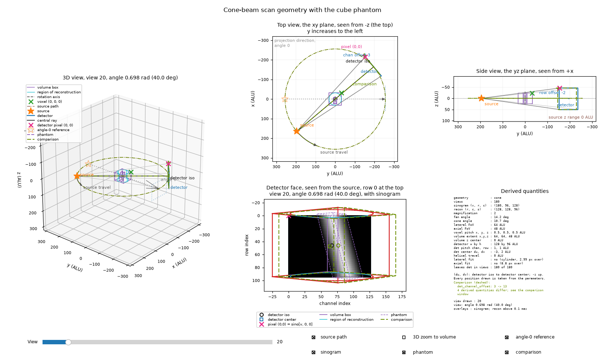

.. _GeometryViewerDocs:

===============
Geometry Viewer
===============

The geometry viewer shows multiple views of the scanner geometry as described
by the model type and parameters.  The viewer has two uses.  The
first is checking a real scan before reconstructing it: the drawing shows where
the source, the detector, and the reconstruction volume sit, which way the
gantry turns, and whether the volume projects inside the detector, so a
detector offset with the wrong sign or a detector too small for the object is
visible in seconds.  The second is comparing an estimated geometry with a
vendor one: a second geometry is drawn over the first, and the numbers that
differ are listed.

Open it on a model with :func:`~mbirtorch.view_utils.geometry_viewer`.

The five panels
---------------

The window holds five panels for one view of the scan.

* The **3D view**, for orientation.  It shows the source, the detector, the
  rays, the rotation axis, and the volume box in space.
* The **top view**, the xy plane.
* The **side view**, the yz plane.
* The **detector face**, in row and channel index.
* The **text panel** of derived numbers: the magnification, the fan and cone
  angles, the field of view at the rotation axis, the voxel pitches, the
  volume's extent, and whether the region of reconstruction fits the detector,
  laterally and axially.

The picture holds the object fixed and moves the source and the detector.
Every panel draws negative z at the
top, so the volume appears the way its array is indexed.  The beam runs from
the source on the left to the detector on the right.  The detector face shows
the view from the source, with row 0 at the top, which is how ``imshow`` shows
one view of a sinogram.

Two markers say which way the indices run: detector pixel (0, 0) and voxel
(0, 0, 0).  They are the first thing to look at when an orientation is in
doubt, because a mirrored channel order or an offset with the wrong sign shows
in them alone.

The controls
------------

A slider under the panels steps through the views.  Six toggles sit beside it
in two rows.  The top row turns the source's path over all views, the 3D zoom
to the volume, and the angle-0 reference on and off.  The bottom row turns the
sinogram, the phantom, and the comparison on and off.  The 3D view panel can be
dragged to change the viewing angle.  A
comparison opens a second window, which displays every difference between the two
geometries, one row per difference.

The two overlays
----------------

Two arrays can be drawn beside the geometry, and both are optional.

* ``sinogram=`` paints one view of a sinogram on the detector face, in gray
  with row 0 at the top, so the object's shadow can be read against the
  outlines drawn over it.  It moves with the slider.  A detector larger than
  128 pixels across is subsampled for display, and ``vmin`` and ``vmax`` fix
  the gray scale.
* ``recon=`` draws a reconstruction or a phantom as a silhouette in the volume
  box of the top view and the side view: the voxels whose absolute value is
  above a threshold, projected along the axis the panel does not draw, with the
  outline of that support drawn over the fill.  It does not move with the
  slider, because the object is what the drawing holds fixed.  The 3D panel
  draws up to nine outlines of the support in planes across its thinnest
  direction, and the legend says how many planes were drawn.

An example
----------

.. code-block:: python

    import mbirtorch

    ct_model = mbirtorch.ConeBeamModel(sinogram.shape, angles,
                                       source_detector_dist=source_detector_dist,
                                       source_iso_dist=source_iso_dist)
    delta_det_channel = ct_model.get_params('delta_det_channel')

    mbirtorch.geometry_viewer(ct_model, sinogram=sinogram, recon=recon,
                              compare=dict(det_channel_offset=10.0 * delta_det_channel),
                              title='Cone-beam scan geometry')

A model returned by a scanner reader is passed in the same way.

         plane, a side view of the yz plane, the detector face in row and
         channel index, and a text panel of derived numbers.

The figure shows the cone-beam scan of ``demo_11_geometry_viewer.py`` at one
view, with the cube phantom's sinogram painted on the detector face and the
comparison's detector drawn dashed.

.. autofunction:: mbirtorch.view_utils.geometry_viewer

The figure object
-----------------

:func:`~mbirtorch.view_utils.geometry_viewer` builds a figure, shows it, and
returns it.  A script that does not want a window can build the same figure
directly and save it.

.. autoclass:: mbirtorch.geometry_figure.GeometryFigure
   :members: set_view, set_show_trajectory, set_zoom, set_show_reference, set_compare, set_sinogram, set_recon, set_show_sinogram, set_show_recon, set_show_compare, save, show

Where a point lands on the detector
-----------------------------------

The drawing projects every point it needs through
:meth:`~mbirtorch.TomographyModel.project_points`, the model's own map from
object points to fractional detector indices.  That map is available to scripts
as well:

.. code-block:: python

    row, channel = ct_model.project_points([[0.0, 0.0, 0.0]], 0)
    print(f'The volume center lands at row {row[0]:.2f}, channel {channel[0]:.2f}.')
