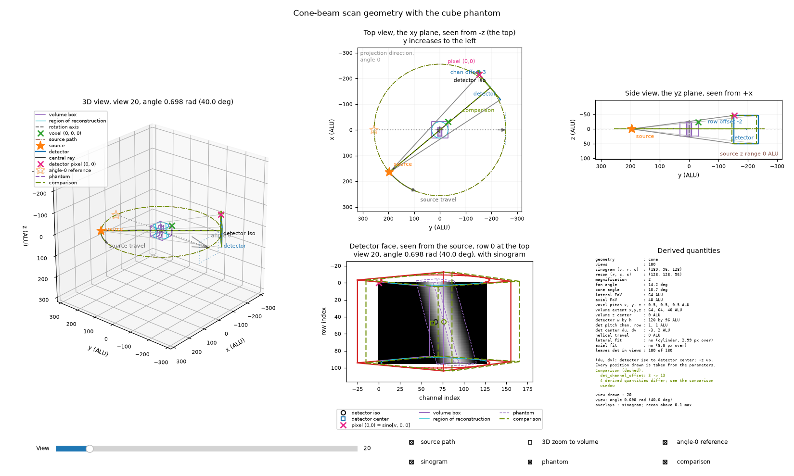

.. _Utilities:

=========
Utilities
=========

MBIRTorch contains utilities for viewing, downloading, exporting/importing, generating
synthetic data, and managing the on-disk compile cache.

Saving and loading models and reconstructions is handled through TomographyModel: :ref:`SaveLoadDocs`.

.. _Viewer4DDocs:

3D and 4D Data Viewers
----------------------

The 3D viewer shows one or more volumes slice by slice, and the 4D viewer adds a frame axis
for a volume that changes in time.

.. autofunction:: mbirtorch.view_utils.slice_viewer

Here is an example showing views of a modified Shepp-Logan phantom, with changing intensity window and displayed slice:

.. image:: https://www.math.purdue.edu/~buzzard/images/slice_viewer_demo.gif
   :alt: An animated image of the slice viewer.

.. autofunction:: mbirtorch.view_utils.slice_viewer4d

A 3D volume shown next to 4D volumes stays fixed in time, so it serves as a reference for the
moving ones.  In a space-time plane (t-x, t-y, or t-z) each row of the image is one frame, and
the two sliders pick the line of the volume that is shown.  An edge that moves from frame to
frame then appears as a slanted or zigzag line.

The figures show the viewer on a synthetic 4D volume: a Shepp-Logan phantom that shifts by up
to two pixels, in a direction that turns 60 degrees per frame, next to the unshifted phantom.
In the x-y plane, the mean inside an ROI on the phantom's edge rises and falls every 6 frames,
and the static phantom gives a flat line.  In the t-y plane the shift appears as a zigzag of
the edges, and the static phantom's edges are straight.

.. plot:: figs/slice_viewer4d.py
   :alt: The 4D viewer in the x-y plane with an ROI and its mean against frame, and in the
         t-y plane, where the edges of the shifting phantom zigzag.

.. _GeometryViewerDocs:

Geometry Viewer
---------------

The geometry viewer draws the scanner geometry of a model: where the source, the detector, and
the reconstruction volume sit, which way the gantry turns, and whether the volume projects
inside the detector.  Use it to check a scan before reconstructing it, and to compare an
estimated geometry with the vendor's by drawing one over the other.

.. code-block:: python

    ct_model = mbirtorch.ConeBeamModel(sinogram.shape, angles,
                                       source_detector_dist=source_detector_dist,
                                       source_iso_dist=source_iso_dist)
    mbirtorch.geometry_viewer(ct_model, sinogram=sinogram, recon=recon,
                              compare=dict(det_channel_offset=10.0),
                              title='Cone-beam scan geometry')

         plane, a side view of the yz plane, the detector face in row and
         channel index, and a text panel of derived numbers.

.. autofunction:: mbirtorch.view_utils.geometry_viewer

General Purpose
---------------

.. autofunction:: mbirtorch.median_filter3d
.. autofunction:: mbirtorch.utilities.stitch_arrays
.. autofunction:: mbirtorch.utilities.get_ct_model
.. autofunction:: mbirtorch.utilities.copy_ct_model
.. autofunction:: mbirtorch.utilities.build_model

Weight Generation
-----------------

.. autofunction:: mbirtorch.vcd_utils.gen_weights
.. autofunction:: mbirtorch.vcd_utils.gen_weights_mar

IO Functions
------------

Saving and loading a reconstruction is described under :ref:`SaveLoadDocs`.

.. autofunction:: mbirtorch.utilities.download_and_extract
.. autofunction:: mbirtorch.utilities.save_volume_as_gif

.. _synthetic-data-generation:

Synthetic Data Generation
-------------------------

.. autofunction:: mbirtorch.utilities.generate_demo_data
.. autofunction:: mbirtorch.utilities.generate_3d_shepp_logan_reference
.. autofunction:: mbirtorch.utilities.generate_3d_shepp_logan_low_dynamic_range

.. autofunction:: mbirtorch.utilities.gen_translation_phantom
.. autofunction:: mbirtorch.utilities.gen_polygon_phantom

For 4D reconstruction, a moving phantom and the sinogram of one scan of it:

.. autofunction:: mbirtorch.utilities.generate_demo_data_4d
.. autofunction:: mbirtorch.phantoms_4d.gen_moving_phantom
.. autofunction:: mbirtorch.phantoms_4d.rack_and_pinion

Cache Management
----------------

MBIRTorch keeps one on-disk cache, of compiled ``torch.compile`` artifacts, so that a fresh
process reuses prior compilations instead of recompiling.  These are stored in
`~/.mbirtorch/torch_cache`.  The cache exists to make cold starts fast -- with it, a
fresh process reuses prior compilations instead of recompiling (roughly 14 s
down to 2 s for a first small reconstruction).  It grows with the number of
distinct compiled shapes and typically stays in the tens of megabytes; it is
never cleaned automatically.  To remove it:

.. code-block:: python

    import mbirtorch
    mbirtorch.clear_cache()   # deletes ~/.mbirtorch entirely (recreated empty)

The location can be redirected by setting the `TORCHINDUCTOR_CACHE_DIR`
environment variable before the first compile (e.g. to node-local or scratch
storage on a cluster, where home quotas are tight); `clear_cache()` does not
touch a redirected location.

Everything else the package caches is in-memory only and is freed with the
objects that hold it (e.g. the per-model pixel-index cache); nothing besides
`~/.mbirtorch` is written to disk.

.. autofunction:: mbirtorch.utilities.clear_cache
